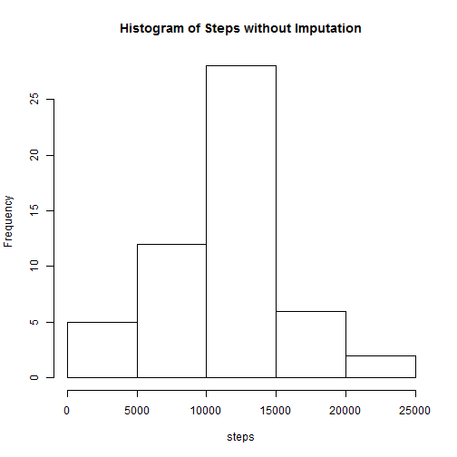

## Loading and preprocessing the data

### Load the data

```r
AMD = read.csv("Activity.csv", stringsAsFactors=FALSE)
```

### Preprodess/transform the data & check the integrity

```r
uDate = unique(AMD[,"date"]) # what unique days 
nDate = length(uDate) # 61 days
uInterval = unique(AMD[,"interval"]) # what unique intervals
nInterval = length(uInterval)  # 288 intervals
if (nInterval != 60*24/5) print("Some intervals are missing")

Lens = vector(length=nDate)
for (i in 1:nDate) Lens[i] = length(AMD[AMD[,"date"]==uDate[i],"steps"])
if (sum(Lens != nInterval) != 0) print("Uneven measurements per day")
```

## What is mean total number of steps taken per day?
### Histogram of Steps without Imputation

```r
TotSteps = aggregate(steps ~ date, data=AMD, sum, na.rm=TRUE)
hist(TotSteps$steps, main="Histogram of Steps without Imputation")
```

 
### Mean and Median without Imputation

```r
mean(TotSteps$steps)  # 10766.19
```

```
## [1] 10766.19
```

```r
median(TotSteps$steps) # 10765
```

```
## [1] 10765
```

## What is the average daily activity pattern?

```r
AvgSteps = aggregate(steps ~ interval, data=AMD, mean, na.rm=TRUE)
plot(uInterval, AvgSteps$steps, type="l", ylab="Average Steps")
```

 

### Which 5 min interval contains the maximum number?

```r
which.max(AvgSteps$steps)  # 104th inteval
```

```
## [1] 104
```

```r
AMD[which.max(AvgSteps$steps),"interval"] # [835, 840) interval
```

```
## [1] 835
```

## Imputing missing values
### total number of missing values

```r
sum(is.na(AMD[,"steps"])) # 2304
```

```
## [1] 2304
```

### Impute NA with average steps in that interval (AvgSteps)

```r
mAMD = matrix(AMD[,"steps"], nrow=nInterval, ncol=nDate)
for (i in 1:nInterval) {
  for (j in 1:nDate) {
    if (is.na(mAMD[i,j])) mAMD[i,j] = AvgSteps[i,"steps"]
  }
}

AMD2 = AMD
AMD2[,"steps.im"] = as.vector(mAMD)
```

### Histogram of Steps with Imputation

```r
TotSteps2 = aggregate(steps.im ~ date, data=AMD2, sum, na.rm=TRUE)
hist(TotSteps2$steps, main="Histogram of Steps with Imputation")
```

 

### mean and median of total steps in days

```r
mean(TotSteps2$steps) # 10766.19
```

```
## [1] 10766.19
```

```r
median(TotSteps2$steps) # 10766.19
```

```
## [1] 10766.19
```


## Are there differences in activity patterns between weekdays and weekends?

```r
weekday.no = (julian(as.Date(AMD2[,"date"])) - 3) %% 7  #0:6 is Sun:Sat
AMD2[,"wday"] = "weekday"  # fill up with default values
AMD2[weekday.no==0 | weekday.no==6, "wday"] = "weekend"
AMD2[,"wday"] = factor(AMD2[,"wday"]) # transform to factor

Steps2 = aggregate(steps ~ interval + wday, AMD2, mean) #no need of na.rm option
library(lattice)
xyplot(steps ~ interval | factor(wday), data=Steps2, aspect=1/2, type="l")
```

 

